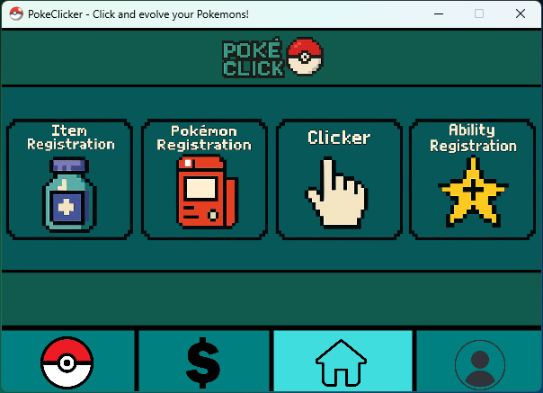

[](https://classroom.github.com/a/zli9RIbW)

## **TCP-Final-20251**

<a id="readme-top"></a>
<br />
<div align="center">
  <a>
    
  </a>

  <h3 align="center">PokeClicker</h3>

  <p align="center">
    A clicker game set in the Pokémon World!
    <br />
  </p>
</div>

<details>
  <summary>Table of Contents</summary>
  <ol>
    <li>
      <a href="#about-the-project">About The Project</a>
    </li>
    <li>
      <a href="#getting-started">Getting Started</a>
      <ul>
        <li><a href="#installation">Installation</a></li>
        <li><a href="#testing-with-junit">Testing With JUnit</a></li>
      </ul>
    </li>
    <li>
      <a href="#usage">Usage</a>
    </li>
    <li>
      <a href="#playing-the-game">Playing the Game</a>
    </li>
  </ol>
</details>

<a id="about-the-project"></a>
## About The Project

**PokeClicker** is an engaging clicker game where players accumulate in-game currency through clicks, which can then be used to acquire **Pokémons** and **items**. Beyond the core clicker mechanic, the game allows players to develop unique **abilities** for their Pokémons and efficiently manage their entire collection. A dedicated feature also enables players to easily access their **favorite Pokémons** on a separate page.

<p align="right">(<a href="#readme-top">back to top</a>)</p>

<a id="getting-started"></a>
## Getting Started

<a id="installation"></a>
### Installation

To set up the project in your VS Code environment, follow these steps:

1.  **Clone the Repository**:
    ```sh
    git clone [https://github.com/SW-Engineering-Courses-Karina-Kohl/tcp-final-20251-grupo05.git](https://github.com/SW-Engineering-Courses-Karina-Kohl/tcp-final-20251-grupo05.git)
    ```

2.  **Download JavaFX Library**:
    Download **JavaFX version 21.0.7 [LTS]**.

3.  **Configure `launch.json`**:
    * Extract the downloaded JavaFX files.
    * Copy the **absolute path** to the `lib` folder within the extracted JavaFX directory.
    * Navigate to your project's `.vscode` folder and open `launch.json`.
    * In the `configurations` section, **remove the second `"projectName"` line**.
    * In the `"vmArgs"` section, paste the copied path. If you are on Windows, ensure you **add an extra backslash** (`\`) after each existing one in the path (e.g., `C:\\path\\to\\javafx\\lib`).

<a id="testing-with-junit"></a>
### Testing with JUnit

**Note**: JUnit tests currently only function on Windows operating systems. Before running the tests, ensure there are no .class files outside the out folder. If you find any, simply delete them.

1.  **Compile Files**:
    Execute the compilation script:
    ```sh
    ./compilar.bat
    ```

2.  **Run Tests**:
    Run the JUnit tests using the following command:
    ```sh
    java -jar lib\junit-platform-console-standalone-1.11.0.jar --class-path "out;lib\sqlite-jdbc-3.50.1.0.jar" --scan-class-path
    ```

<p align="right">(<a href="#readme-top">back to top</a>)</p>

<a id="usage"></a>
## Usage

<a id="running-on-vscode"></a>
### Running on VSCode
To run the PokeClicker application:

1. Open VS Code and navigate to the **Debug and Run** view (typically the icon that looks like a bug with a play button).
2. Ensure the **"Launch" tab** is selected.
3. Click the **green play button** to start the application.
<div align="center">
  <a>
    
  </a>
  <br>
</div>

<a id="playing-the-game"></a>
### Playing the Game
1. To begin, enter your desired username.
<div align="center">
  <a>
    
  </a>
  <br>
</div>
<br>
2. After logging in, you will be directed to your Player Page. Here, you can view your favorite Pokémons and your current money balance. You can also log out from this screen.
<br><br>
<div align="center">
  <a>
    
  </a>
</div>
<br>
3. Navigate to the Home Page to find four main activities: Item Registration, Pokémon Registration, Clicker, and Ability Registration. 
<br><br>
<div align="center">
  <a>
    
  </a>
</div>
<br>
3.1 To register a new item, complete the form by providing its details and selecting an item type, as shown in the examples below.
<div align="center">
  <a>
    
    
  </a>
</div>
<br>
The newly registered item will now appear on your PC.
<div align="center">
    <a>
        
    </a>
</div>
3.2. Similarly, to register a new Pokémon, you must fill out the form with its details, select its type, and upload an image for it, as shown in the example. Once registered, the Pokémon will be added to your collection, which can also be viewed on the PC.
<br>
<br>
3.3. To earn money in the Clicker, simply click the button repeatedly!
<div align="center">
    <a>
        
    </a>
</div>
<br>
<br>
3.4. Registering a new Ability follows a similar process. Fill out the form with the ability's details and select its type as shown in the example.
<div align="center">
    <a>
        
        
    </a>
</div>
<br>
<br>
4. By selecting the money icon in the navigation bar, you can visit the Shop, where all created items are available for purchase.
<div align="center">
    <a>
        
    </a>
</div>
<br>
<br>
5. The Pokéball icon takes you to the PC, which stores all of your captured Pokémons and purchased items.
5.1. You can filter your Pokémon collection by different criteria and clear the filters to view all of them. You can also switch between viewing your Pokémon and your items.
<div align="center">
    <a>
        
        
    </a>
</div>
